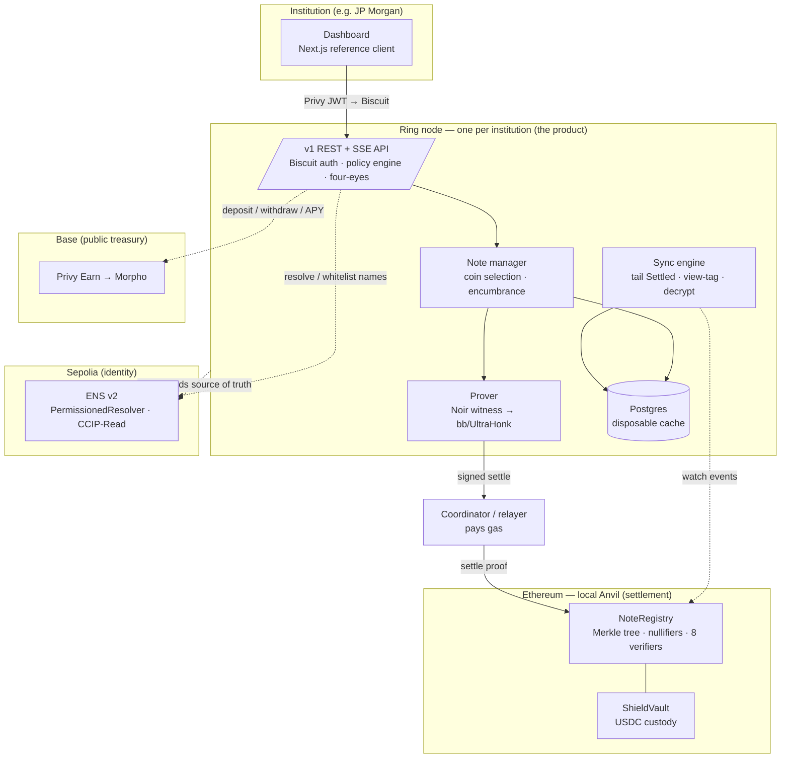
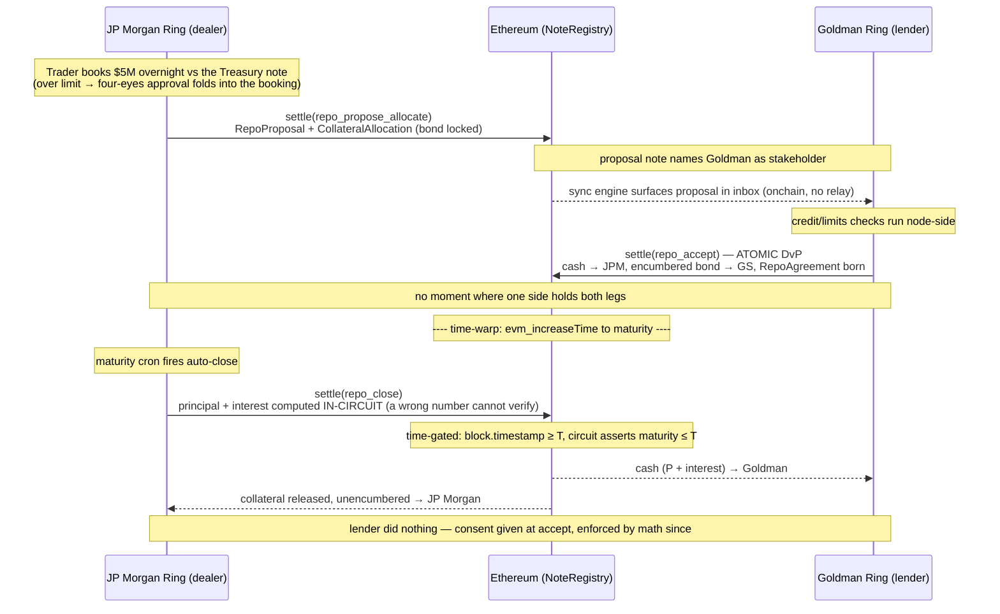

# Aragorn — Canton, rebuilt on public Ethereum

Aragorn reimplements **Canton Network's institutional ledger model** — UTXO-style notes, sub-transaction privacy, and authority-from-contract workflows like repo — directly on **public Ethereum**, using **Noir ZK circuits** for settlement. Each institution runs a sovereign private node called a **Ring**: it holds the keys, decrypts only its own notes, generates proofs, and enforces internal policy, while the chain sees nothing but gray rings — commitments, nullifiers, and a verified proof. The demo cast: **JP Morgan** (dealer) and **Goldman Sachs** (lender) settling a bilateral repo against a US Treasury note. *Keep it secret, keep it safe.*

Built at ETHGlobal New York 2026.

---

## How it works

Canton is, stripped of branding, five primitives — a UTXO-shaped contract set, sub-transaction privacy by projection, templates with party-based authorization, a synchronizer that orders and commits, and a self-sovereign participant node. Aragorn maps each onto Ethereum: the note tree and nullifier set *are* the contract set; encrypting payloads to stakeholders *is* projection; **templates compile to Noir circuits**; **Ethereum L1 is the synchronizer** (ordering, atomicity, neutrality, no consortium to govern); and the **Ring** is the participant node.

**On Ethereum (local Anvil settlement plane):**

- **NoteRegistry** — the singleton settlement contract. An incremental Poseidon2 Merkle tree of note commitments (depth 32), a recent-roots ring buffer (64), a nullifier set, and a per-circuit verifier registry. Its entrypoint is `settle(circuitId, proof, publicInputs, ciphertexts[])`: verify the proof against a root in the window, check nullifier freshness, insert new commitments, emit `Settled`. A multi-leg DvP either fully lands or fully reverts.
- **ShieldVault** — USDC custody at the asset boundary. Depositors pre-fund a commitment with `depositFor`; `cash_shield` consumes that escrow and `cash_unshield` releases USDC. Callable only by NoteRegistry on a valid proof.

**Off Ethereum (the Ring node, one per institution — the product):**

- **Note manager** — coin selection, change notes, the encumbrance state machine (free ⇄ allocated ⇄ encumbered), Canton-style `CONTENTION` retry. Institutions never see a note or a nullifier.
- **Prover** — Noir witness generation, then a `bb`/UltraHonk proof, in an in-process queue.
- **Sync engine** — tails `Settled` events, scans 4-byte view tags, decrypts only the ciphertexts addressed to the Ring's key, and upserts its projection. Postgres is a **disposable cache**: `ring resync --from-zero` wipes it and rebuilds the entire book from chain events + keys.
- **Policy engine** — roles, per-user notional limits, and **four-eyes** approvals (an over-limit action becomes a `PendingApproval` that an approver must confirm before the Ring signs with the party key). ENS counterparty whitelist gates inbound/outbound proposals.
- **Biscuit auth** — Privy login is exchanged for a short-lived, public-key-verified [Biscuit](https://biscuitsec.org) session token carrying the user's entitlements; service tokens are scoped and offline-attenuable. One enforcement path for humans and machines.

**Onchain propose-accept (no message relay):** inter-Ring workflows travel through the chain itself — a proposal note names the counterparty as a stakeholder, and their sync engine surfaces it in their inbox. There is no off-chain messaging service to run.

**The dashboard** is a Next.js reference client: capability-driven rendering from the session Biscuit, a portfolio/blotter/inbox/admin, and a split-screen "what the world sees" public-view panel reading raw `Settled` events.

### The eight circuits

Settlement is carried by 8 Noir circuits sharing an `aragorn_lib` gadget crate:

`cash_shield` · `cash_transfer` · `cash_unshield` · `cash_fanout` · `entitlement_claim` · `repo_propose_allocate` · `repo_accept` · `repo_close`

Onchain verification uses **`bb`/UltraHonk Solidity verifiers** (`bb write_solidity_verifier`, one per circuit). Groth16 via World's ProveKit was the originally specified primary prover. ProveKit *does* now ship a gnark-based **recursive Groth16 wrapper** (it re-verifies a WHIR proof inside a gnark BN254 circuit and runs `groth16.Setup/Prove/Verify`) — but it stops off-chain: it never calls gnark's `vk.ExportSolidity()` and discards the proof rather than serializing EVM calldata, so there is **no onchain Groth16 artifact today**. The spec's pre-declared fallback to native UltraHonk therefore stands. A cheaper Groth16 onchain path is production roadmap (it needs the Solidity-export glue forked into ProveKit's Go + a per-circuit trusted setup); gas (~1.5–2M/verify) is irrelevant on local Anvil.

The protocol in five lines:

```
payload_hash      = Poseidon2(template fields)            # Cash, BondPosition, RepoProposal, …
stakeholders_hash = Poseidon2(sorted party pubkeys)
commitment        = Poseidon2([template_id, version, payload_hash, stakeholders_hash, salt])
nullifier         = Poseidon2([commitment, note_secret])  # note_secret shared with ALL stakeholders
settle(circuitId, proof, [root, T, n1..n4, c1..c4, aux1..aux4], ciphertexts[])
```

`note_secret` travels encrypted to every stakeholder — which is what makes **authority-from-contract** possible: at repo close the dealer legitimately consumes the *lender's* encumbered collateral because the circuit proves the governing agreement is being exercised correctly. Authority flows from contracts, not just keys.

---

## Contract addresses

Three planes: **settlement** on local Anvil (chain id 31337, MockUSDC), **identity** on real ENS v2 (Sepolia), **public treasury** on real Base (Privy Earn → Morpho).

### Settlement — local Anvil (chain id 31337)

| Contract | Address |
|---|---|
| NoteRegistry | `0xcf7ed3acca5a467e9e704c703e8d87f634fb0fc9` |
| ShieldVault | `0x9fe46736679d2d9a65f0992f2272de9f3c7fa6e0` |
| MockUSDC | `0xe7f1725e7734ce288f8367e1bb143e90bb3f0512` |
| Poseidon2 (Yul) | `0x5fbdb2315678afecb367f032d93f642f64180aa3` |
| Verifiers (8, one per circuit) | (deploy-time; see `contracts/deployments.local.json`) |

The 10 per-circuit UltraHonk verifiers are vendored under `contracts/src/verifiers/`, deployed by `scripts/deploy.ts`, registered in NoteRegistry's `circuitId → verifier` map, and frozen at deploy; their addresses are assigned at deploy time (see `contracts/deployments.local.json`).

### Identity — ENS v2 (Sepolia)

Identity is fully v2-native: names registered via the real v2 ETHRegistrar (commit-reveal), records on owner-deployed PermissionedResolver proxies, and — for the institution's own subtree — a **Ring-owned `PermissionedRegistry` subregistry** so departments are minted as real onchain ERC-1155 subname tokens (not just wildcard records). Resolution walks v2's hierarchical registries; deepest resolver wins.

**ENS v2 Sepolia contracts (canonical set):**

| Contract | Address |
|---|---|
| `.eth` PermissionedRegistry | `0xDEDB92913A25abE1f7BCDD85D8A344a43B398B67` |
| ETHRegistrar (commit-reveal) | `0x8c2E866B439358c41AE05De9cbE8A00BFEFafFcA` |
| Payment token (MockERC20) | `0x3DfC8b53dAFa5eBbb071a8B97678Ab534Ed838D9` |
| VerifiableFactory | `0xd2A632D8A8b67C2c4398c255CBd7Af8Dd7236198` |
| PermissionedResolver impl | `0xdcE5205A553573FFd47629327DDdf36186022FfA` |
| Resolver proxy logic | `0x917C561a74Df398646e06f3FFAA51DB8e8330C5A` |
| **Subregistry impl** (deployable `UserRegistry`) | `0x0F99e7Ea74903AfCB7224d0354fD7428A6f92917` |
| UniversalResolverV2 | `0xeEeEEEeE14D718C2B47D9923Deab1335E144EeEe` |

**Aragorn names deployed on Sepolia:**

| Item | Value |
|---|---|
| Canonical demo 2LD | `aragornrings.eth` (resolver proxy `0xC909a297A23e9Fa567E78D5F6a95C311531694F8`) |
| Sovereign-subregistry demo 2LD | `aragorn-sovereign.eth` |
| ↳ Ring-owned subregistry | `0x0F82660DaCC722BE248857DEceA6a50Fce7F65FD` |
| ↳ department tokens minted | `treasury.aragorn-sovereign.eth`, `trading.aragorn-sovereign.eth` (each with `aragorn.partykey` / `aragorn.desk`, verified resolving via UniversalResolverV2) |

A premigration name `aragorn-rings.eth` carries the CCIP-Read employee gateway on the v1 classic resolver. (Design-decision records — the `D-NNN` tags referenced throughout — are preserved in git history.)

---

## Sponsors

### ENS — the identity layer (there are no accounts, only names)

ENS is not naming garnish in Aragorn — it *is* the account model. Institutions and their departments are ENS v2 names: `aragornrings.eth` is the 2LD, with per-org subnodes (`jpmorgan.aragornrings.eth`, `goldman.aragornrings.eth`) and department nodes (`treasury.<org>.aragornrings.eth`). Each name carries the records that make a counterparty resolvable rather than addressable: `aragorn.encpubkey` (the Ring's X25519 encryption key), `aragorn.endpoint`, `aragorn.partyroot`, and `aragorn.modules`, written on an **owner-deployed v2 PermissionedResolver proxy** (deployed through the VerifiableFactory with `ROLE_SET_ADDR | ROLE_SET_TEXT` bitmaps; D-012). Resolution walks v2's hierarchical registries and the deepest resolver wins — the onchain analogue of an ENSIP-10 wildcard.

This is load-bearing in the code, not cosmetic: counterparty whitelisting *is* resolving a name and caching its records (`apps/ring/src/ens.ts`), every transfer routes a `.eth` spec through `resolveRecipient()` (`flows.ts`) — a 4+-label name reads a department's settlement party key live from ENS, a 2-/3-label name resolves a whitelisted org — and the Ring **boots by reading its own ENS records as the source of truth**, verifying the onchain `encpubkey`/`partyroot` against its local keys and taking `enabledModules` from the name (`apps/ring/src/index.ts`).

Going further than records, an institution **owns its name's subtree onchain**: provisioning deploys a per-institution `PermissionedRegistry` (the v2 `UserRegistry` impl) via the VerifiableFactory and attaches it with `setSubregistry` — the registrant already holds `ROLE_SET_SUBREGISTRY` from the ETHRegistrar, so no extra grant is needed — and then mints each department (`treasury`, `trading`) as a real **ERC-1155 subname token** it controls (`scripts/ens-v2-subregistry.ts`, live on `aragorn-sovereign.eth`, both departments verified resolving through UniversalResolverV2). Departments stop being wildcard records and become first-class onchain entities the institution can mint and revoke itself. Employee identities (`cat.jpmorgan.aragornrings.eth`) are served as **CCIP-Read (ERC-3668) offchain subnames** by a signing gateway *inside the Ring*: the L1 resolver pins the org's signing key, so even a hosted gateway cannot forge a record, and employee names stay capabilities (shared bilaterally, non-enumerable) rather than a public directory. The product rule that falls out of all this: **no hex anywhere in the UI**.

### World — ProveKit (Track D)

The payroll claim is the one consumer-shaped flow in the system, and it is proved **client-side, in the employee's browser** — the witness (salary, note secrets, `claim_secret`) never leaves their device (`apps/dashboard` runs the prover in a web worker). The `entitlement_claim` circuit is deliberately **pure-Poseidon** (secret-knowledge auth, no embedded-curve operations) precisely so it is backend-portable across proving systems.

For World Track D specifically, that same circuit is proved through **ProveKit's Noir → R1CS → WHIR pipeline** as a standalone spike (`spikes/provekit-booth/`): proven under `provekit-cli` with off-chain verification (an accepted Track D target environment) and **bit-for-bit hash-compatible with `bb.js`**. Honest scope: ProveKit's in-browser SDK (Verity) is blocked by an upstream build-version mismatch, so the ProveKit proof is CLI-level, while the in-dashboard browser claim uses `bb.js`/UltraHonk WASM. Onchain settlement also uses `bb`/UltraHonk — ProveKit's WHIR proofs have no EVM verifier, and its recursive Groth16 wrapper, while real, still exports no Solidity verifier (see *The eight circuits* above). So ProveKit is a legitimate Track-D proving target for the claim circuit, not a load-bearing part of the settlement path.

### Privy — auth, the funding wallet, and yield

Privy is the entire human layer, and the reason there are no wallets anywhere by design. Institutional users sign in with their **work email**; the Ring verifies the Privy JWT server-side and exchanges it for a scoped, short-lived **Biscuit** session token carrying the user's entitlements — so people get *authorization*, never keys, and nothing phishable walks out the door with an employee (Canton's own no-end-user-wallets model, with consumer-grade onboarding in front). Invites are restricted by email domain allowlist.

On the public plane, the Ring's funding wallet — the shield/unshield ramp between public USDC and private notes — is a **Privy server wallet**. And idle treasury USDC earns real yield through **Privy Earn**, which allocates to **Morpho ERC-4626 vaults on Base** (Gauntlet/Steakhouse), with live balance/APY and working deposit/withdraw in the dashboard (D-004). That is the "tradfi + crypto-native yield" story in one SDK; the private-strategies card (the position itself a shielded note) sits greyed beside it as roadmap.

---

## Running it

Prerequisites: bun 1.2.22, Node ≥ 22 (Rings run on Node for `biscuit-wasm`), docker, Foundry, `nargo` 1.0.0-beta.21, `bb` 5.0.0-nightly.20260324. Secrets live in `.env.local` (see `.env.example`).

```bash
bun install
make p0     # toolchain gate: prover pipeline + Poseidon2 three-way byte-equality (TS↔Noir↔Solidity)
make p1     # circuits + contracts + scripted shield→transfer→unshield (real proofs)
make p2     # two Rings + relayer: private Ring→Ring payment via curl, sync convergence, resync
make p3     # Privy→Biscuit, four-eyes, live Sepolia ENS whitelist + CCIP gateway, dashboard shell
make p4     # full repo cycle incl. time-warp auto-close + payroll run/claim
make p5     # Privy Earn (real Base) + in-browser claim proving
make demo   # demo-reset → the full ~10-minute script against a running stack
```

The settlement chain is plain local Anvil (`--block-time 1`); deploys run via `scripts/deploy.ts` (viem) rather than `forge script` (D-013). `make demo-reset` redeploys + reseeds (Rings rebuild from events, so state snapshots are not used). ENS reads hit a real Sepolia RPC; Privy Earn runs against real Base — both are real-network services and cannot run on the local chain.

---

## Diagrams

### System architecture



### Repo lifecycle (atomic DvP, in-circuit interest)



---

## Honest scaffolding (PoC simplifications, named in the demo)

Per-circuit verifiers (no kernel recursion yet — anonymity-set unification is narrated, not implemented), ciphertexts in events (not EIP-4844 blobs), one shared relayer, software keys (no HSM/FROST), local Anvil as the settlement chain, the seeded Goldman bond position (`bond_issue`/`bond_dvp_accept` not built), and `repo_default` greyed. UltraHonk needs no trusted setup; the Groth16 wrap that would cut gas is production roadmap. The full production design is the project's north star — notes, templates-as-circuits, authority-from-contract, propose-accept, allocation, fan-out, re-encumbrance, oracle attestations, and time bounds appear to be a *complete* primitive set for institutional finance.
